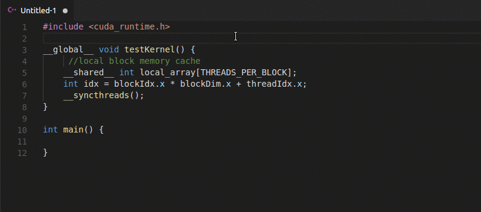
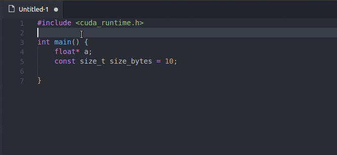

# CUDA for VSCode (syntax + snippets)

This extension aims at providing syntax support and snippets for CUDA (C++) in VS Code. 

**This extension DOES NOT provide "IntelliSense like" features, as the task to implement it is really big. Use this extension when you quickly need to edit a kernel or a \_\_device__ function and want the variables and functions to be readable.**

## Features

### Code coloring

This extension supports most of the basic CUDA keywords and functions, such as but not limited to :

- cudaMalloc, cudaFree, ...
- \_\_global\_\_, \_\_device\_\_, \_\_host\_\_, ...
- atomicAdd, atomicSub, surfCubemapLayeredread, ...
- \_\_shfl_down, \_\_syncthreads, ...



To maximize compatibility with existing popular themes, [textmate language grammar guidelines](https://manual.macromates.com/en/language_grammars#naming_conventions) have not always been respected (external libraries like CUDA in support scope). If your theme still doesn't color the CUDA code, you can set them with the template rules below (put this into your VSCode user settings in settings.json). This can also be used to override your theme colors, if you want to separate C++ and CUDA colors.

```json
"editor.tokenColorCustomizations": {
    "textMateRules": [
        {
            "scope": "support.function.cuda-cpp",
            "settings":{
                "foreground": "#56b6c2"
            }
        },
        {
            "scope": "keyword.function.qualifier.cuda-cpp",
            "settings":{
                "foreground": "#56b6c2"
            }
        }
    ]
}
```

#### List of scopes

- **"support.function.cuda-cpp"** :             atomicAdd, cudaMalloc, cudaFree, ...
- **"keyword.function.qualifier.cuda-cpp"** : \_\_global\_\_, \_\_host\_\_, \_\_device\_\_, ...
- **"storage.modifier.cuda-cpp"** : \_\_constant\_\_, \_\_device\_\_, \_\_shared\_\_, ...
- **"support.type.cuda-cpp"** : dim3, uint1, ulong1, ...
- **"variable.language.cuda-cpp"** : gridDim, blockIdx, blockDim, threadIdx, warpSize
- **"punctuation.section.kernel"** : the kernel brackets <<< >>>
- **"meta.kernel-call.cuda-cpp entity.name.function.c"** : the function name before the <<< >>>

### CUDA snippets

The following snippets are available :

- **\_\_s** : __syncthreads();
- **cmal** : cudaMalloc((void**)&${1:variable}, ${2:bytes});
- **cmalmng** : cudaMallocManaged((void**)&${1:variable}, ${2:bytes});	
- **cmem** : cudaMemcpy(${1:dest}, ${2:src}, ${3:bytes}, cudaMemcpy${4:Host}To${5:Device});
- **cfree** : cudaFree(${1:variable});
- **kerneldef** : \_\_global\_\_ void ${1:kernel}(${2}) {\n}
- **kernelcall** : ${1:kernel}<<<${2},${3}>>>(${4});
- **thrusthv** : thrust::host_vector<${1:char}> v$0;
- **thrustdv** : thrust::device_vector<${1:char}> v$0;



## Requirements

- VSCode 1.18+. Slightly older versions should work, very old versions are not guaranteed to work.
- This extension has been tested with the default VSCode skin (dark+) and the popular One Dark Pro theme. 

## Extension Settings

This extension contributes the following settings:

* none
<!-- * `vscuda.enable`: enable/disable this extension -->

## Known Issues

- No support for Intellisense navigation through code (right click->Go to definition,...). This will be implemented by [another extension](https://github.com/kriegalex/vscode-cudatools) dedicated to IntelliSense and debugging. For now, the development is on hold indefinitely. Anyone is welcome to overtake or fork it.

## Planned features

Below are listed the features that ideally should be available for this extension. IntelliSense and debugging coexist in [another repository](https://github.com/kriegalex/vscode-cudatools). There is no guarantees this features will be implemented.

- Icon for files
- CUDA syntax colors as parameters of this extension instead of using "editor.tokenColorCustomizations" in settings.json

## Feature requests & issues

Requests should be made here : https://github.com/kriegalex/vscode-cuda/issues 

## Release Notes

See also the [changelog](CHANGELOG.md)

### 0.1.0

Initial release of vscode-cuda extension

### 0.1.1

Better documentation

-----------------------------------------------------------------------------------------------------------
